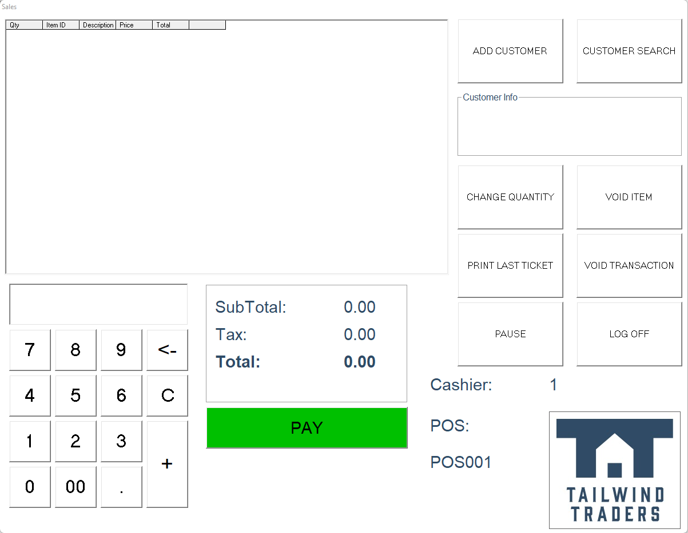
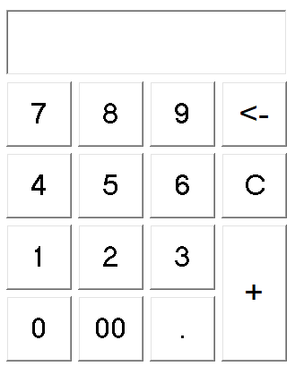
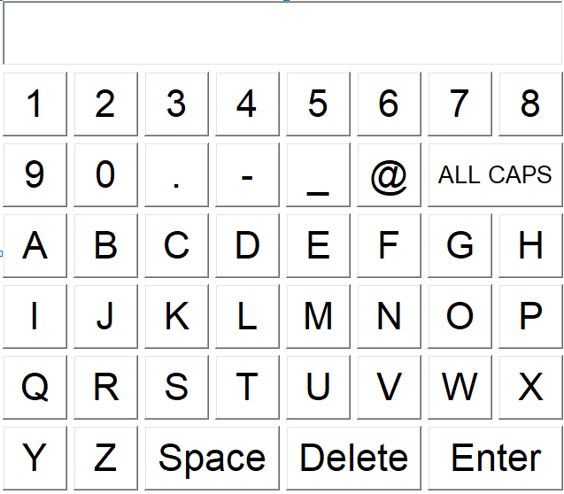

# Tailwind Traders - Point of Sale

# About the App

Tailwind Traders business has technology at its heart. It blends the ease of online shopping with the familiarity of a mom-n-pop corner hardware store, and is quickly making a name for itself in the relatively new virtual hardware market. Like many modern organizations, it has evolving internal and external technology needs, and it approaches each moment of transformation with confidence.

# What can you see in this app

The **Tailwind** application use User Controls to avoid duplicate the same set of controls in multiple forms.

or

# Technologies used

This application was developed in VB6, it uses mostly the intrinsic VB6 controls.
- VB.Label
- VB.CommandButton
- VB.TextBox
- MSFlexGridLib.MSFlexGrid

The database used is an **Access** Database called `POS.mdb`

It uses *ADODB* to connect to this DB.

Additionally, it will connect to a web API to get information about the products added during its execution.